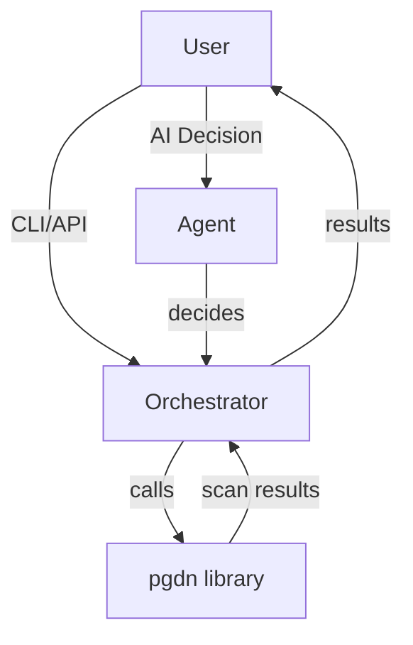

# PGDN Orchestrator Suite

A modular orchestration suite for DePIN security scanning, combining AI-powered decision making with robust, production-grade scanning via the external [pgdn](https://pypi.org/project/pgdn/) library.

---

## Overview

This suite provides two main orchestration components:

1. **AI Orchestration Agent (`agent.py`)**
    - Uses OpenAI or Anthropic LLMs to decide what scan actions to take, based on node, organization, and policy context.
    - Returns structured decisions (e.g., scan level, skip, escalate) with reasoning.
    - Useful for policy enforcement, adaptive scanning, and intelligent automation.

2. **Scan Orchestrator & CLI (`orchestrator.py`, `cli.py`)**
    - Wraps the external `pgdn` library to actually run network, vulnerability, and protocol scans.
    - Callable as a Python library or via the `pgdn-orchestrate` CLI.
    - Handles scan execution, result collection, and reporting.

You can use these components independently or together for full AI-driven, policy-aware scanning workflows.

---

## Architecture



- **Agent**: Decides what to do (scan, escalate, skip, etc.) using LLMs.
- **Orchestrator**: Executes scans using the external `pgdn` library.
- **CLI**: Exposes orchestrator as a command-line tool.

---

## Installation

```bash
pip install -e .
```
- Requires Python 3.8+
- Installs [pgdn](https://pypi.org/project/pgdn/) automatically

---

## Usage

### 1. As a Python Library (Direct Scan)

```python
from pgdn_orchestrator.orchestrator import run_scan

result = run_scan("192.168.1.1", org_id="myorg", scan_level=2)
print(result)
```

### 2. As a CLI

```bash
pgdn-orchestrate --target 192.168.1.1 --org-id myorg --scan-level 2
```

- `--target`: Target host/IP to scan (required)
- `--org-id`: Organization ID (required)
- `--scan-level`: Scan level (1, 2, or 3; default: 1)

### 3. AI-Driven Orchestration (with LLMs)

```python
from pgdn_orchestrator.agent import OrchestrationAgent
from pgdn_orchestrator.orchestrator import run_scan

# Prepare your node, org, and policy dicts
node = {"id": "node-1", "host": "192.168.1.1", "protocol": None}
organisation = {"id": "myorg", "ferocious_enabled": True}
scan_policy = {"max_escalation": "ferocious", "require_discovery": True}

# 1. Use the AI agent to decide what to do
agent = OrchestrationAgent()
decision = agent.decide(node, organisation, scan_policy)

if decision.next_action.startswith("scan_"):
    scan_level_map = {"scan_light": 1, "scan_medium": 2, "scan_ferocious": 3}
    scan_level = scan_level_map[decision.next_action]
    # 2. Run the scan using the orchestrator
    result = run_scan(node["host"], organisation["id"], scan_level)
    print(result)
else:
    print(f"AI decided: {decision.next_action}")
```

---

## Project Structure

- `pgdn_orchestrator/agent.py`: AI-powered orchestration agent (OpenAI/Anthropic)
- `pgdn_orchestrator/orchestrator.py`: Library entry point, wraps the external pgdn orchestrator
- `pgdn_orchestrator/cli.py`: CLI entry point (exposed as `pgdn-orchestrate`)
- `pgdn_orchestrator/models.py`: Data models for orchestration
- `pgdn_orchestrator/prompts.py`: Prompt generation for LLMs

---

## Extensibility

- **Add new scan policies** by updating the policy dicts passed to the agent.
- **Customize AI prompts** in `prompts.py` for different orchestration strategies.
- **Swap LLM providers** by configuring API keys for OpenAI or Anthropic.
- **Integrate with other systems** by calling `run_scan` or the agent from your own code.

---

## External Documentation

- [pgdn PyPI](https://pypi.org/project/pgdn/)
- [pgdn Modular Scanning System](./scanning.md) (see this repo)

---

## License

See LICENSE file.
